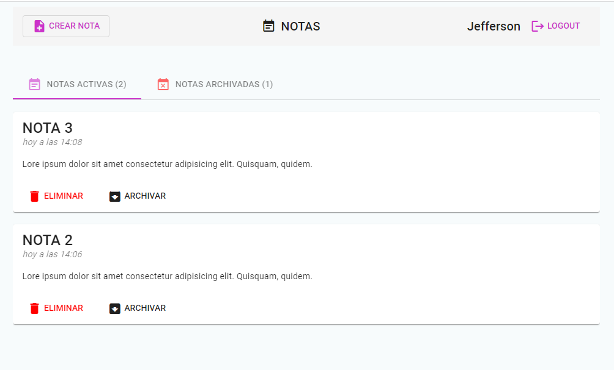
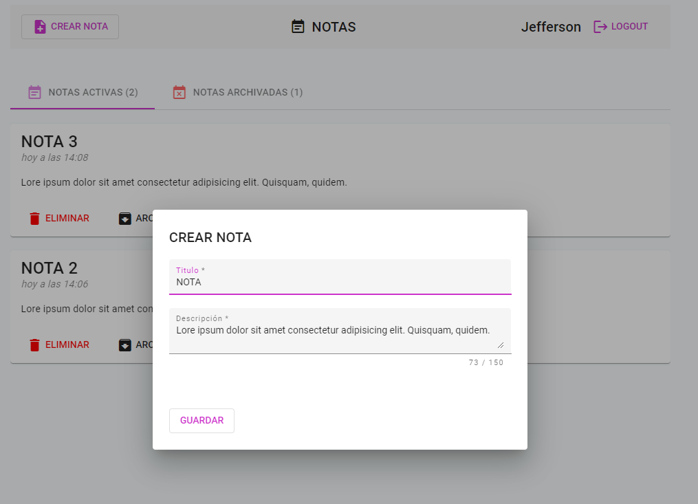
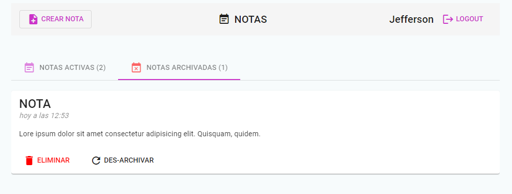
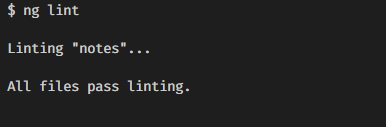

# Notes

Proyecto de Notas generado con [Angular CLI](https://github.com/angular/angular-cli) version 13.3.3.

# Autor 
Jefferson Rivera Patiño  
riverajefer@gmail.com

## Development server

Run `ng serve` for a dev server. Navigate to `http://localhost:4200/`. The application will automatically reload if you change any of the source files.

## Build

Run `ng build` to build the project. The build artifacts will be stored in the `dist/` directory.

## Demo 
https://riverajefer.github.io/notes/ 

## Imágenes Demo

### Notas

### Crear Nota

### Notas Archivadas

### Ng Lint

